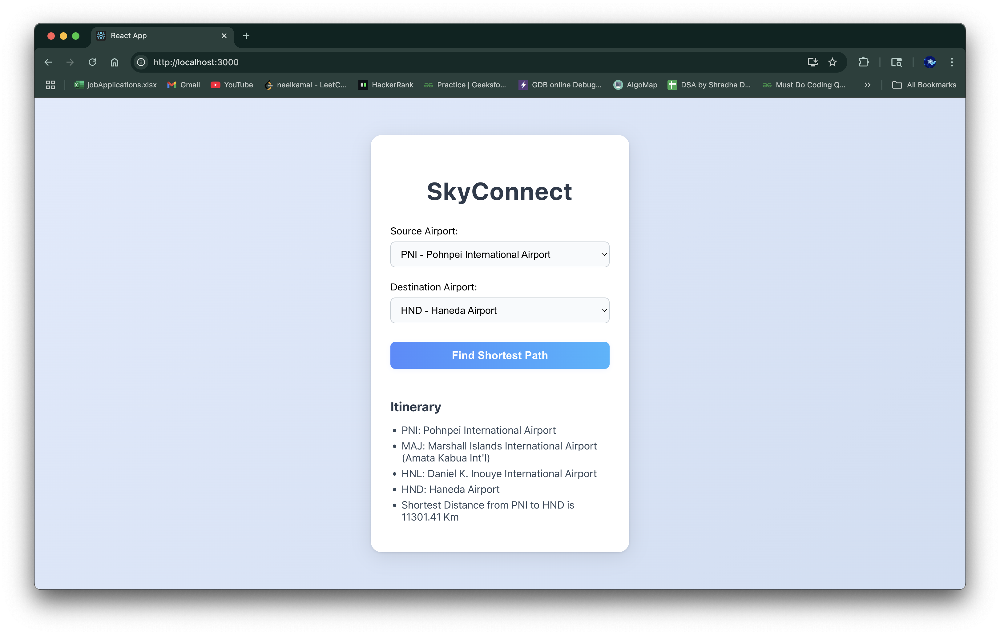

<p align="center">
  
</p>

<h1 align="center">SkyConnect</h1>

<p align="center">
  <em>Find the shortest flight path between two airports using Dijkstra’s Algorithm</em>
</p>

---

## ✈️ Project Overview

**SkyConnect** is an interactive web application that helps users find the **shortest flight path between any two international airports**. Originally a Java CLI tool, the project has been transformed into a full-stack application using **Spring Boot** on the backend and **React.js** for the frontend.

It leverages **Dijkstra’s Algorithm** to compute the shortest path and total distance between airports. The interface is simple and intuitive—ideal for educational, logistics, or travel-related applications.

---

## 📸 Screenshots

<p align="center">
  
  
</p>

---

## 🎯 Features

- 🌐 Dropdowns for selecting source and destination airports  
- 🔍 Computes the **shortest path** with step-by-step itinerary  
- ✅ Disabled "Find Path" button until both inputs are selected  
- 📏 Displays **total distance** in kilometers  
- 💡 Clean and responsive UI for a smooth user experience

---

## 🧰 Tech Stack

| Layer        | Technology              |
| ------------ | ----------------------- |
| **Frontend** | React.js, HTML5, CSS3   |
| **Backend**  | Spring Boot (Java)      |
| **Algorithm**| Dijkstra's Algorithm    |
| **API**      | RESTful Endpoints       |
| **Build Tools** | Maven, npm           |

---
## ⚡ Getting Started

To set up SkyConnect locally:

```bash
# 1. Clone the repository
git clone https://github.com/neelkamalrana/SkyConnect.git

# 2. Navigate to the project backend directory 
cd airport-backend

# 3. Install required dependencies
mvn clean install

# 4. Start the development server
mvn spring-boot:run

# 5. Navigate to the project frontend directory 
cd airport-frontend

# 3. Install required dependencies
npm install

# 4. Start the development server
npm start
